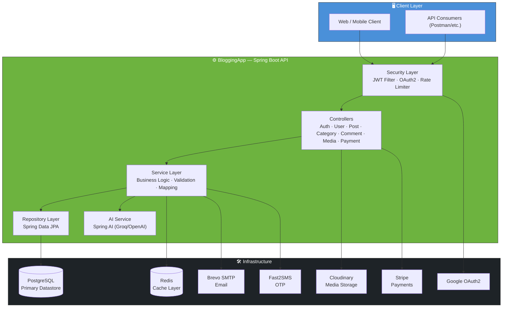
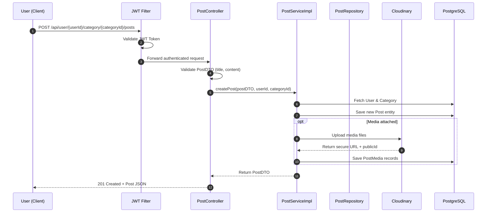
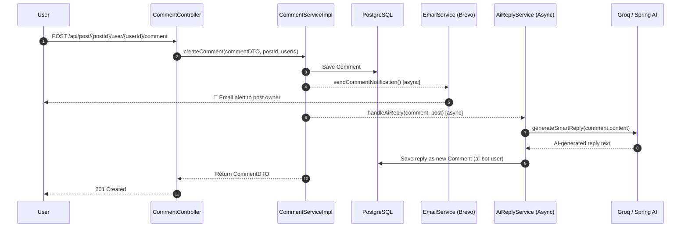
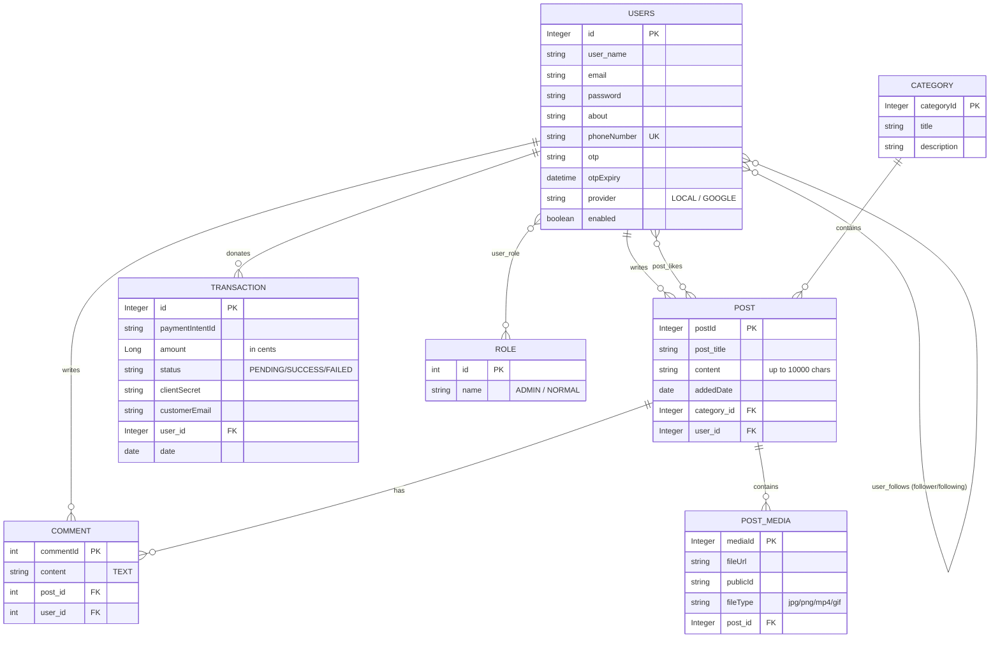

<div align="center">

# 📝 ByteBlog — BloggingApp

### A production-ready, full-featured Blogging Platform REST API built with Spring Boot

*Write. Share. Engage. Monetize.*

[](https://openjdk.org/)
[](https://spring.io/projects/spring-boot)
[](https://www.postgresql.org/)
[](https://redis.io/)
[](https://www.docker.com/)
[](https://stripe.com/)
[](#-license)

[Features](#-features) • [Architecture](#-architecture) • [Database Schema](#-database-schema) • [API Reference](#-api-reference) • [Getting Started](#-getting-started) • [Deployment](#-deployment) • [Live Demo](#-live-demo)

</div>

## 🎬 Live Demo

🎥 **[Watch the full demo](https://drive.google.com/file/d/1eXKJIXwlUVilKOBR2jjmQ8EkN9UM4Lml/view?usp=sharing)** — a walkthrough of the API in action: auth, posts, comments, AI replies, payments, and more.
🌐 **Live API:** [`https://byteblog.up.railway.app`](https://byteblog.up.railway.app)

---

## 📖 Overview

**ByteBlog (BloggingApp)** is a secure, scalable, and feature-rich blogging platform backend built with **Spring Boot 3**, **PostgreSQL**, and **Redis**. It goes far beyond a simple CRUD blog — it ships with **JWT authentication, Google OAuth2 login, OTP-based password recovery, Stripe donations, AI-powered content assistance, rate limiting, and cloud media storage** out of the box.

It is designed as a real backend for a production blog/social platform — the kind that could power a Medium-style publishing app or a personal blog network.

---

## ✨ Features

Here's what's packed inside:

<table>
<tr>
<td width="50%" valign="top">

### 🔐 Security First
- **JWT Authentication** + Google **OAuth 2.0** social login
- **Rate Limiting** to prevent abuse (Bucket4j)
- **Redis-powered Logout** — tokens are blacklisted on `/logout` for their remaining lifetime, so no stale/reused tokens
- **OTP-based Forgot Password** via SMS (Fast2SMS)
- Role-based access control (`ADMIN`, `NORMAL`)
- Global exception handling

### 📝 Core Blogging Features
- **Posts, Categories, Comments** — full CRUD
- **Follow/Unfollow** system with follower/following counts
- **Like/Unlike** a post
- Admin roles & user management
- Post search by keyword, pagination & sorting everywhere

</td>
<td width="50%" valign="top">

### 📧 Smart Notifications
- **SMTP email alerts** on new comments (via Brevo API), styled HTML templates included

### 🤖 AI-Powered Comments
- **AI auto-replies to comments** — an async job generates a smart reply (via Groq/Spring AI) and posts it back as an "AI bot" user, in one of three configurable personalities

### 💳 Stripe Donation System
- Readers can support their favourite bloggers via **Stripe** payment intents & checkout sessions, with webhook-based confirmation

### ☁️ Cloudinary for Media
- All post media (image/video/gif) is stored on **Cloudinary** — no more in-memory/local storage needed

### 🐳 Dockerized & Live on Railway
- Multi-stage `Dockerfile`, deployed and running at `byteblog.up.railway.app`

</td>
</tr>
</table>

> **Note:** OAuth2 login is currently wired up for **Google**; GitHub OAuth is on the roadmap and not yet present in `SecurityConfig`. Update this note (and the badges above) once it ships.

---

## 🏗 Architecture



### Request Flow — Creating a Post



### Request Flow — AI Auto-Reply to a Comment



---

## 🗄 Database Schema

The application uses **PostgreSQL** with **Hibernate/JPA** (`ddl-auto=update`) for schema management. Below is the full entity-relationship diagram derived directly from the JPA entities.



### Table Notes

| Table | Purpose | Key Relationships |
|---|---|---|
| `users` | Core user account, auth & profile data | M:N with `role` (`user_role`), self-referencing M:N (`user_follows`) |
| `role` | Authorization roles | Joined via `user_role` |
| `category` | Blog post categories | 1:N with `post` |
| `post` | Blog posts | N:1 `user`, N:1 `category`, 1:N `comment`, 1:N `post_media`, M:N `users` (`post_likes`) |
| `comment` | Comments on posts | N:1 `post`, N:1 `user` |
| `post_media` | Uploaded media (Cloudinary) attached to a post | N:1 `post` |
| `transaction` | Stripe donation/payment records | N:1 `user` (nullable — supports anonymous donations) |

---

## 🔌 API Reference

**Base URL (local):** `http://localhost:8080` · **Base URL (deployed):** `https://byteblog.up.railway.app`

<details>
<summary><b>🔑 Auth &nbsp;·&nbsp; <code>/api/v1/auth</code></b></summary>

| Method | Endpoint | Description |
|---|---|---|
| `POST` | `/api/v1/auth/register` | Register a new user |
| `POST` | `/api/v1/auth/login` | Login & receive JWT token |
| `POST` | `/api/v1/auth/forgot-password` | Send OTP to phone number |
| `POST` | `/api/v1/auth/verify-otp` | Verify OTP & reset password |
| `GET` | `/api/v1/auth/google/success` | Google OAuth2 callback |
| `POST` | `/api/v1/auth/logout` | Logout — blacklists the JWT in Redis for its remaining TTL |

</details>

<details>
<summary><b>👤 Users &nbsp;·&nbsp; <code>/api/users</code></b></summary>

| Method | Endpoint | Description |
|---|---|---|
| `GET` | `/api/users/getAllUser` | List all users |
| `GET` | `/api/users/{userId}` | Get user by ID |
| `PATCH` | `/api/users/{userId}` | Update user profile |
| `PATCH` | `/api/users/profile/set-password` | Change password |
| `DELETE` | `/api/users/{userId}` | Delete user |
| `PUT` | `/api/users/{userId}/assign-admin` | Promote user to admin |
| `POST` | `/api/users/follow/{targetUserId}` | Follow / unfollow toggle |
| `GET` | `/api/users/{userId}/followers` | List followers |
| `GET` | `/api/users/{userId}/following` | List following |

</details>

<details>
<summary><b>📚 Categories &nbsp;·&nbsp; <code>/api/categories</code></b></summary>

| Method | Endpoint | Description |
|---|---|---|
| `POST` | `/api/categories/` | Create category |
| `PUT` | `/api/categories/{categoryId}` | Update category |
| `DELETE` | `/api/categories/{categoryId}` | Delete category |
| `GET` | `/api/categories/{categoryId}` | Get category by ID |
| `GET` | `/api/categories/getCategories` | List all categories |

</details>

<details>
<summary><b>📰 Posts &nbsp;·&nbsp; <code>/api</code></b></summary>

| Method | Endpoint | Description |
|---|---|---|
| `POST` | `/api/user/{userId}/category/{categoryId}/posts` | Create a post |
| `GET` | `/api/posts` | Get all posts (paginated) |
| `GET` | `/api/posts/{postId}` | Get post by ID |
| `GET` | `/api/user/{userId}/posts` | Get posts by user |
| `GET` | `/api/category/{categoryId}/posts` | Get posts by category |
| `GET` | `/api/posts/search/{keywords}` | Search posts by keyword |
| `PUT` | `/api/posts/{postId}` | Update a post |
| `PUT` | `/api/posts/{postId}/category/{categoryId}` | Move post to another category |
| `DELETE` | `/api/posts/{postId}` | Delete a post |
| `POST` | `/api/post/{postId}/like/{userId}` | Like / unlike a post |

> All list endpoints support `pageNumber`, `pageSize`, `sortBy`, `sortDir` query params.

</details>

<details>
<summary><b>💬 Comments &nbsp;·&nbsp; <code>/api</code></b></summary>

| Method | Endpoint | Description |
|---|---|---|
| `POST` | `/api/post/{postId}/user/{userId}/comment` | Add a comment |
| `PUT` | `/api/comment/{commentId}` | Update a comment |
| `DELETE` | `/api/comment/{commentId}` | Delete a comment |
| `GET` | `/api/comment/{userId}` | Get comments by user |

</details>

<details>
<summary><b>🖼️ Media &nbsp;·&nbsp; <code>/api/media</code></b></summary>

| Method | Endpoint | Description |
|---|---|---|
| `POST` | `/api/media/upload/{postId}` | Upload media (image/video/gif) to a post |
| `PUT` | `/api/media/update/{mediaId}` | Replace media file |
| `DELETE` | `/api/media/delete/{mediaId}` | Delete media |
| `GET` | `/api/media/download/{mediaId}` | Download media file |

</details>

<details>
<summary><b>💳 Payments &nbsp;·&nbsp; <code>/api/v1/payments</code></b></summary>

| Method | Endpoint | Description |
|---|---|---|
| `POST` | `/api/v1/payments/create-intent` | Create a Stripe payment intent |
| `POST` | `/api/v1/payments/create-checkout-session` | Create a Stripe checkout session |
| `POST` | `/api/v1/payments/confirm/{intentId}` | Confirm a payment |
| `GET` | `/api/v1/payments/success` | Payment success redirect |
| `POST` | `/api/v1/payments/webhook` | Stripe webhook receiver |

</details>

---

## 📦 Sample Requests & Responses

Real request bodies taken straight from the project's own Postman collection.

**Register a new user**
```http
POST /api/v1/auth/register
Content-Type: application/json
```
```json
{
    "name": "Sachin Aswal",
    "email": "sachin@gmail.com",
    "password": "Password@1234",
    "about": "I am a Software Engineer",
    "phoneNumber": "9876543210"
}
```

**Login**
```http
POST /api/v1/auth/login
Content-Type: application/json
```
```json
{
    "username": "rohit11joshi10@gmail.com",
    "password": "Password@1234"
}
```
```json
{
    "token": "eyJhbGciOiJIUzUxMiJ9.eyJzdWIiOiJyb2hpdDExam9zaGkxMEBnbWFpbC5jb20i...",
    "user": {
        "id": 17,
        "name": "Rohit Joshi",
        "email": "rohit11joshi10@gmail.com"
    }
}
```

**Create a post**
```http
POST /api/user/17/category/2/posts
Content-Type: application/json
Authorization: Bearer <JWT_TOKEN>
```
```json
{
    "title": "Java",
    "content": "Getting started with modern Java development."
}
```

**Create a category**
```http
POST /api/categories/
Content-Type: application/json
```
```json
{
    "categoryTitle": "Python Programming",
    "categoryDescription": "Tutorials on Python and Flask/Django."
}
```

**Add a comment**
```http
POST /api/post/2/user/17/comment
Content-Type: application/json
```
```json
{
    "content": "Great write-up on microservices, thanks for sharing!"
}
```

**Update profile**
```http
PATCH /api/users/10
Content-Type: application/json
```
```json
{
    "name": "Rohit Joshi",
    "phoneNumber": "9758238757",
    "about": "Hey! I am a Blogger"
}
```

---

## 🛠 Tech Stack

| Layer | Technology |
|---|---|
| **Language** | Java 17 / 21 |
| **Framework** | Spring Boot 3.2.4 (Web, Data JPA, Validation, Actuator) |
| **Security** | Spring Security · JWT (`jjwt`) · OAuth2 Client (Google) |
| **Database** | PostgreSQL |
| **Caching** | Redis |
| **Media Storage** | Cloudinary |
| **Payments** | Stripe |
| **Email** | Brevo (SMTP/API) |
| **SMS/OTP** | Fast2SMS |
| **AI** | Spring AI + Groq (OpenAI-compatible, `llama-3.3-70b-versatile`) |
| **Rate Limiting** | Bucket4j |
| **Object Mapping** | ModelMapper |
| **Build Tool** | Maven |
| **Containerization** | Docker (multi-stage build) |

---

## 🚀 Getting Started

### Prerequisites
- Java 17+ (project targets Java 21 at compile time)
- Maven 3.9+
- PostgreSQL instance
- Redis instance
- (Optional) Cloudinary, Stripe, Google OAuth2, Brevo, Fast2SMS, and Groq API credentials for full functionality

### 1. Clone the repository
```bash
git clone https://github.com/RohitJoshi10/BloggingApp.git
cd BloggingApp
```

### 2. Configure environment variables
The app reads its configuration from environment variables (see `src/main/resources/application.properties`):

```bash
# Database
SPRING_DATASOURCE_URL=jdbc:postgresql://localhost:5432/blogdb
SPRING_DATASOURCE_USERNAME=postgres
SPRING_DATASOURCE_PASSWORD=postgres

# Cloudinary
CLOUDINARY_CLOUD_NAME=your_cloud_name
CLOUDINARY_API_KEY=your_api_key
CLOUDINARY_API_SECRET=your_api_secret

# Email
BREVO_API_KEY=your_brevo_key
SPRING_MAIL_USERNAME=your_sender_email

# SMS OTP
FAST2SMS_API_KEY=your_fast2sms_key

# Google OAuth2
GOOGLE_CLIENT_ID=your_google_client_id
GOOGLE_CLIENT_SECRET=your_google_client_secret

# Stripe
STRIPE_SECRET_KEY=your_stripe_secret
STRIPE_PUBLISHABLE_KEY=your_stripe_publishable_key
STRIPE_WEBHOOK_SECRET=your_stripe_webhook_secret

# Redis
REDIS_HOST=localhost
REDIS_PORT=6379
REDIS_PASSWORD=your_redis_password

# AI (Groq)
GROQ_API_KEY=your_groq_api_key
```

### 3. Build & run
```bash
./mvnw clean install
./mvnw spring-boot:run
```

The API will be available at `http://localhost:8080`.

### 4. Run with Docker
```bash
docker build -t bytebllog-app .
docker run -p 8080:8080 --env-file .env bytebllog-app
```

The included `Dockerfile` uses a **multi-stage build** — Maven builds the JAR in a build stage, then a lightweight `eclipse-temurin:21-jdk-jammy` image runs it.

---

## 🌐 Deployment

This project is deployment-ready for platforms like **Railway** or **Render**, which can inject the datasource and secret environment variables automatically. A live instance is configured at:

```
https://byteblog.up.railway.app
```

---

## 📁 Project Structure

```
BloggingApp/
├── src/main/java/com/BloggingApp/BloggingApp/
│   ├── AI/                 # AI reply/content generation services
│   ├── config/              # App, Security, Redis, Cloudinary configuration
│   ├── controllers/         # REST controllers (Auth, User, Post, Category, Comment, Media, Payment)
│   ├── entities/             # JPA entities (User, Post, Category, Comment, PostMedia, Role, Transaction)
│   ├── exceptions/          # Global exception handling
│   ├── infrastructure/      # Email, Payment (Stripe), Redis, SMS services
│   ├── payloads/             # DTOs & request/response payloads
│   ├── repositories/        # Spring Data JPA repositories
│   ├── security/             # JWT filter, entry point, rate limiting
│   ├── services/             # Business logic implementations
│   └── utils/                 # Helper utilities (OTP, etc.)
├── src/main/resources/
│   ├── application.properties
│   └── ByteBlog.postman_collection.json   # Ready-to-import Postman collection
├── Dockerfile
└── pom.xml
```

---

## 🤝 Contributing

Contributions, issues, and feature requests are welcome!

1. Fork the project
2. Create your feature branch (`git checkout -b feature/amazing-feature`)
3. Commit your changes (`git commit -m 'Add some amazing feature'`)
4. Push to the branch (`git push origin feature/amazing-feature`)
5. Open a Pull Request

---

## 📄 License

This project is available under the **MIT License** — feel free to use it for learning or as a base for your own projects.

---

<div align="center">

Made with ☕ and Spring Boot by **[Rohit Joshi](https://github.com/RohitJoshi10)**

</div>
